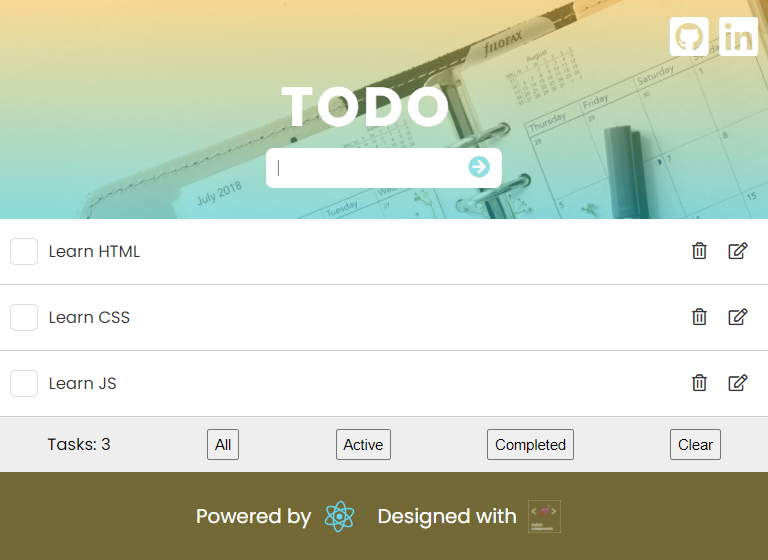

# Todo App

This is my version of popular daily tasks app. It's very popular app these days but built it helped me to better understood of libriaries I used. The core of this project is React library. To create visual side of an app I decided to used Styled-Components. Also I used React Beautiful DnD for better task management. All tasks are keep in Local Storage.

## Live

https://mate966.github.io/todo-list/

## Plans

I'm gonna refactor the code and implement Redux.

## Author

-   **Mateusz Szweda** - [Mate966](https://github.com/mate966)
-   **My portfolio** - [Portfolio](https://mateuszszweda.pl)

### Getting Started with Create React App

This project was bootstrapped with [Create React App](https://github.com/facebook/create-react-app).

### Available Scripts

In the project directory, you can run:

### `npm start`

Runs the app in the development mode.\
Open [http://localhost:3000](http://localhost:3000) to view it in your browser.

The page will reload when you make changes.\
You may also see any lint errors in the console.
